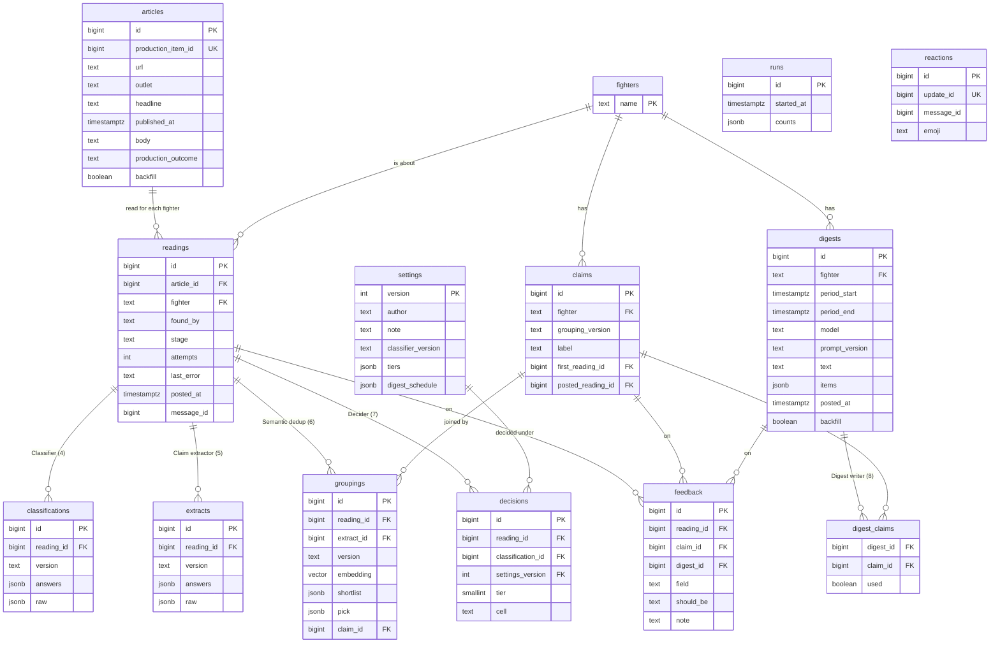

# v0: the whiteboard design, running end to end

*Drafted 2026-10-04 and 2026-10-05 by Claude for Anton's review. Nothing
here is built. The scope and order of the tasks are on the Golden Set Map
([golden/plan.html](../../../golden/plan.html), the "v0" filter). This
document says how they are built; its decision log (section 1) records what
was settled and why.*

## Station names

Every station is named as on the map, with its number in brackets. The
number is its place in the pipeline.

| # | Station | In v0 |
|---|---|---|
| 1 | RSS reader | production's, reused (section 2) |
| 2 | URL dedup | production's, reused |
| 3 | Body extractor | production's, reused |
| 4 | Classifier | v0: JEV, nine questions |
| 5 | Claim extractor | v0: Qwen, one sentence and its details |
| 6 | Semantic dedup | v0: joins each article to a claim, or starts one |
| 7 | Decider | v0: looks the answers up in the settings |
| 8 | Digest writer | v0: the digest per fighter |
| 9 | Telegram and storyboard | v0: the new chat, and the web app |

## What v0 is

The design drawn on the whiteboard ([docs/design/system.excalidraw](../../design/system.excalidraw))
runs as its own hourly job, beside production. It keeps its own database and
posts to its own new Telegram chat. Production keeps running as it is.

```
production:  RSS reader (1) → URL dedup (2) → Body extractor (3) → … production's own decisions → group chat
                                                    │
                                                    ▼ v0 reads each new article, with its body
v0:   Classifier (4) → Claim extractor (5) → Semantic dedup (6) → Decider (7) ─┬─ tier 1: post now ───────────┐
                                                                               ├─ tier 2: Digest writer (8) ──┴→ Telegram (9)
                                                                               └─ tier 3: dropped
```

v0 answers one question: **does this design, on live news, deliver what
Anton wants to read: each piece of tier-1 news posted once, the rest in a
digest worth reading, and nothing he cares about missing?** "Once" is the
repeats problem: ten outlets reporting one booking make one post, not ten.

## 1. Decision log

Settled decisions in the order they were made. A changed decision gets a
new entry; old entries stay.

| # | Decision | Why |
|---|---|---|
| D1 | Tier 1 is a result, or a next fight reported or official. Tier 2 is health, rumours, status updates, remarks, analysis. Tier 3 is not about him. | The starting mapping, editable on the settings page (D11). |
| D2 | An article without a usable body is counted, never classified. | The classifier was tuned on bodies; a headline-only answer would be a guess. |
| D3 | JEV picks the claim an article joins; Haiku is the swap if it cannot. | One vendor for judgement in v0. |
| D4 | v0 posts to a new chat. | Production's group stays untouched. |
| D5 | The first tier-1 article of a claim posts; the claim's other articles never post. | One post per piece of news. |
| D6 | TypeScript, Mastra as the conveyor, our database as the record. Stations are plain modules; versions pinned; the golden replay is plain code. | Learning Mastra without letting it own the data. |
| D7 | A third database, `v0`, in the existing Neon project. | The bench sits beside production the same way; the project uses 63 MB of its 1 GB (measured). |
| D8 | Anton's notes on the storyboard are feedback: a correction ("should be X") or a comment. Refined once he sees it working. | Not every note is a correction. Build first, refine on sight. |
| D9 | The Decider (7) is a lookup, not a model, until a case for a model appears. | Free, instant, and every answer can be explained. |
| D10 | Daily counts go out at 07:00 Pacific. | Anton is in San Francisco. |
| D11 | Settings live in the database, versioned, edited on a storyboard page or by Claude through the database. | Anton wants to see and move the mapping. |
| D12 | Mastra's `.foreach` is used, with a step that catches its own failure. | Measured; section 5. |
| D13 | A second Telegram bot; two reactions, 👍 and 👎, as an experiment built last. | Section 10. |
| D14 | The storyboard deploys from Git, automatically; its main address follows `main`. | Section 12. |
| D15 | v0 reads its articles from production's `items` table; it fetches no feed. | Nothing is fetched twice; production's code does not change. |
| D16 | An article and a fighter are joined many to many: one article can be read for several fighters. | It is how articles are; production's one-fighter rule is a limit of production, kept out of v0's schema. |
| D17 | Each station's answers live in their own table, with a version; nothing is overwritten. | Versions will change and old articles will be re-answered. |
| D18 | The Digest writer (8) is in v0. | The digest is half of what v0 delivers. |
| D19 | v0 starts with production's whole archive, re-answered, never posted, after the Classifier (4) and Claim extractor (5) are frozen on their test sets, each on Anton's explicit go. | A full storyboard and past digests from day one. |
| D20 | Merge the current branch into `main` before v0 code starts. | The branch is too big; production deploys by hand, so a merge deploys nothing. |
| D21 | Answers are stored in v0's own shape: question → value, as `jsonb`, for both the Classifier (4) and the Claim extractor (5); the vendor's full reply is kept beside it. | One pattern for both; a vendor's reply format does not shape our tables. |
| D22 | Semantic dedup (6): candidates are the fighter's claims with an article in the last **14 days**, ranked by their closest article, **top 5**, **no similarity cutoff**. | Measured on the golden set; section 6. |
| D23 | v0 has its own API keys, one per vendor: JEV, OpenRouter. Embeddings go through OpenRouter, so no Gemini key. All of v0's values sit in **one** secret. | Section 12: Secret Manager's free tier is already full. |
| D24 | One digest per fighter. Its schedule is a setting, weekly on Monday 07:00 Pacific to start, changeable at any time. | Each fighter has his own stories. |
| D25 | The Digest writer (8) runs on a strong, cheap open model on OpenRouter, with reasoning on; the model is chosen by comparing digests of past weeks. | Section 8. |
| D26 | The archive run happens on the laptop, against the `v0` database. | It uses none of Cloud Run's free tier, which v0 and production together bring to about 81%. |

**Waiting for Anton:** choice C5 at the end of this document.

## 2. Where v0's articles come from

**v0 fetches no feed (D15).** Production's RSS reader (1), URL dedup (2)
and Body extractor (3) already store every new article, with its body, in
production's `items` table. v0 reads those rows through a database role
that can only read `items`. Creating that role changes production's
database, so it waits for Anton's yes.

**Timing.** Production runs at :17, v0 at :47. They are separate Cloud Run
Jobs; neither waits for the other. Each run, v0 imports **every production
article from the last 3 days that v0 does not have yet**.

That rule means v0 never has to know when production finished, or when v0
itself last ran. Three examples:
- **Production is slow** and stores an article at :50, after v0 read. Next
  hour, that article is "from the last 3 days, not in v0 yet", so it comes
  in then.
- **v0 runs twice by accident.** The second run finds nothing that is not
  in v0 yet, so it imports nothing. No duplicates.
- **v0 is down for a day.** Its next run takes everything from the missed
  day. Nothing is lost, as long as the gap is under 3 days.

The other way, "import what arrived since my last run", would lose
articles in the first case and duplicate them in the second.

**If production fails after storing its articles,** v0 runs normally. If
production stops altogether, v0 still runs: it finds nothing new, keeps
retrying waiting readings and sending its messages, and the daily counts
show "0 imported", which also tells Anton production is down.

**Fighters (D16).** An article can be about several fighters, so v0's
schema joins articles and fighters many to many: one **reading** per
article and fighter. That is the general shape, not a workaround. The only
production-shaped part is how v0 *decides* which fighters an article is
about, and that lives in the import, not in the tables:

- Production finds articles in two ways: Google News searches by the
  fighter's name, and six outlet feeds are filtered by name stems. Either
  way, it files the article under one fighter, and if a second fighter's
  search finds the same article, URL dedup (2) drops it as already seen.
- So v0, on import, checks every watched fighter's name stems in the
  headline and body (`matchesSubject`, the function production uses on
  outlet feeds), and makes one reading per fighter it finds. `found_by`
  records how: `production` (production filed it under him) or `name_in_text`
  (v0 found him in the text).
**Does production's logic limit what v0 sees?** Hardly. Production
searches Google News for each fighter's name and filters the outlet feeds
by each fighter's name stems; whatever any of those finds is stored once,
under the first fighter that found it. So v0 receives the union of what
the per-fighter searches find, which is what searching for each fighter
separately would give, and its name check then attaches every fighter the
text names. What v0 cannot recover:
- an article production never found for any fighter (the same blind spot
  production has);
- for an article with no body, a second fighter named only in the body
  (the check sees the headline alone; such articles are not classified
  anyway, D2);
- nothing is lost to production's 5-articles-per-run cap, only delayed.

**No body:** the readings start at stage `no_body` (D2).

**History (D19).** About 1,300 archive articles, re-answered by v0's
stations oldest first, never posted. "Never posted" means v0 does not post
history; it says nothing about what production did with them.

**The archive run happens on the laptop (D26),** not on Cloud Run: the
same code, pointed at the `v0` database, run once by hand. It uses none of
Cloud Run's free tier, it can be watched as it goes, and a stop halfway
loses nothing, since every answer is written as it is made and the next
start picks up the readings still waiting. It needs v0's live keys in a
local file for that one run.

## 3. The database

### The diagram



PK is the row's id. FK points at a row of another table. **UK is a unique
key**: no two rows share the value, so a production article is imported
once.

**`jsonb`** is a Postgres column type that holds a JSON document in a
parsed, indexed form. It is not plain text: a query can ask
`answers->>'fact' = 'result'`, and an index makes that fast.

### The tables, in plain words

- **`articles`**: one row per web page, as production stored it, plus
  production's own outcome for it (posted, digest, held, joined), kept for
  the comparison with production.
- **`fighters`**: the three watched fighters. Each run adds any name in
  `watchlist.js` that is missing; nobody types them.
- **`readings`**: one row per article *and* fighter (D16): where the
  reading is (`stage`, `attempts`, `last_error`), whether it was posted,
  and `found_by` (production filed it under him, or v0 found his name).
  The name says what the row is: the stations *read* the article for this
  one fighter. It can be renamed later at little cost.
- **`classifications`**: the Classifier's (4) answers for one reading.
  `answers` holds the nine answers **after the tie rules**: plain values
  that agree with each other, such as `{"fact": "result",
  "reports_his_result": "yes", …}`, with no probabilities. `raw` holds JEV's
  full reply, probabilities and confidence included, for diagnosis.
- **`extracts`**: the Claim extractor's (5) answers in the same pattern:
  `answers` = `{"kind", "claim", "occasion", "actor", "opponent", "event",
  "date"}`, `raw` = Qwen's reply (D21).

**Why the answers are `jsonb` and not one column each.** The questions
change between versions: v8 may add a question, drop one or rename one.
With a column per question, every such change is a change to the table,
and old rows sit beside empty new columns. With `jsonb`, each row holds the
answers *its* version asked, and its `version` says which that was. The
questions themselves are versioned as files in the repository
(`v0/pipeline/stations/classifier/questions-v7.7.json`), so a row's
version points at the exact text that produced it. What stays in columns
is what every version shares: the reading, the version, the time.

**The database does not check the shape; v0's code does.** Postgres
accepts any JSON in a `jsonb` column, so a row of v7.7 with nine answers
and a row of v8 with eleven sit side by side without complaint. The price
of that freedom is that a typo ("fcat" for "fact") would also be accepted.
So each version has a schema in code (a `zod` schema, the same kind Mastra
uses for its steps) listing its questions and their allowed values, and the
store checks every answer against its version's schema before writing it.
A test checks each schema against its question file. Anything that
compares versions, such as the storyboard showing v7.7 beside v8, compares
only the questions both asked and shows the rest as "not asked".

The one thing that reads answer names is the settings: "what new fact ·
how firm" only means something for a classifier version that asks those
two questions. So each settings version records the classifier version it
was written for, and the Decider (7) refuses to apply settings to answers
of another version.
- **`groupings`**: the Semantic dedup's (6) answer, explained below.
- **`decisions`**: the Decider's (7) answer: the tier, the settings cell
  that gave it (for example "next fight · rumour"), the settings version.
- **`claims`**: a group of readings about one occasion. `label` is the
  claim sentence of its **first** reading, word for word.
  `grouping_version` says which version of Semantic dedup (6) made the
  claim: if the grouping method changes and the archive is grouped again,
  the new claims are kept apart from the old ones.
- **`settings`**: every version of the tier mapping and the digest
  schedule (section 7).
- **`digests`** and **`digest_claims`**: every digest, and every claim the
  Digest writer (8) was given, with whether it used it (section 8).
- **`feedback`**: Anton's notes, on a reading, a claim or a digest.
  `should_be` is filled for a correction ("tier should be 1"), empty for a
  comment.
- **`runs`**: one row per hourly run. `counts` holds that run's numbers:
  `{"imported": 31, "no_body": 6, "classified": 25, "failed":
  {"classify": 1}, "new_claims": 9, "posted": 2, "stuck": 0}`. The daily
  counts and the storyboard's runs page read it.
- **`reactions`**: 👍 and 👎 from the v0 chat (section 10).

### What claims are for, when everything hangs on readings

Each station answers for a reading, because each answer is about one
article for one fighter: one article can be a rumour, the next the official
announcement. **Claims hold what is true of a piece of news across its
articles:**

1. **"Once" is a claim rule.** The first tier-1 reading of a claim posts;
   every later reading of that claim does not (D5). Without claims, ten
   articles about one booking post ten times.
2. **Semantic dedup (6) compares a new article with claims,** not with
   loose articles.
3. **The Digest writer (8) thinks in claims:** one story, its age, how many
   outlets carry it, how it moved since the last digest.
4. **The storyboard and feedback** show and correct the grouping.

### Semantic dedup (6), step by step

An article arrives for Topuria: ESPN reports his booking against Oliveira.

1. **Embed:** the article is turned into a vector from
   `"<occasion>: <claim>"`, its headline and the first 1,500 characters.
2. **Shortlist:** of Topuria's claims that have an article in the last 14
   days, the 5 whose closest article is most similar to this one, each with
   its similarity from 0 to 1:
   `[{claim 31, 0.91}, {claim 28, 0.77}, {claim 30, 0.64}, …]`. The
   shortlist exists because JEV cannot be shown every claim; it is the
   question's list of options.
3. **Pick:** JEV is shown the article and the 5 claims' labels, and answers
   which claim it belongs to, or "none of these". Stored as `{claim: 31,
   confidence: 0.88}`; `{claim: null}` starts a new claim.

Both are kept because they fail differently: if the right claim is not in
the shortlist, the embedding is at fault; if it is there and JEV chose
another, the pick is at fault.

### Which article gets posted

A claim's **first** reading gives it its label. Its **posted** reading is
the first with tier 1. Often the same article, not always: if a rumour
starts the claim (tier 2) and the official announcement joins it later
(tier 1), the announcement is posted, with **its own** extract sentence.

### When the official word settles a rumour: the label

As drawn, the label is the first extract and never changes. So in the
example above, the claim stays labelled "Reports say Topuria may fight
Oliveira", even after the UFC announced it. The post is still right (it
uses the announcement's own sentence), but two things read the label:
JEV, when it picks a claim for the next article, and the storyboard. This
is the "stale leader" risk (task 6.9), and the measurement in section 6
supports it: ranking claims by their first article finds the right one
less often than ranking by their closest article. Choice C5.

### How the schema meets each requirement

| Requirement | Met by |
|---|---|
| One article for several fighters | `readings`, unique on article and fighter |
| Each reading has a stage; failures wait for the next run | `readings.stage`, `attempts`, `last_error` |
| Nothing skips a station | A stage moves only when that station's row is written |
| Nothing deleted or overwritten | No role has `DELETE`; answers are new rows; a trigger refuses updates to answer tables |
| Every answer says which version gave it | `version` on each station table; `settings_version` on decisions |
| A claim is labelled by its first extract | `claims.label`, `first_reading_id` |
| One post per claim | `claims.posted_reading_id` set once; a unique index stops a second post |
| History never posts | `articles.backfill`, checked before any post or digest |
| Which claims a digest used and skipped | `digest_claims.used` |
| Storyboard filters | Indexed columns, and an index on `answers` |
| Feedback on a reading, a claim or a digest | `feedback`, exactly one target per row |
| Daily counts | `runs.counts` |
| Comparison with production | `articles.production_outcome` beside v0's decision |
| Settings configurable and versioned | `settings`, one new row per change |
| Golden replay kept apart from live data | The same tables in a second schema, `replay` |

A database view, `reading_now`, joins each reading to its answers from the
versions the pipeline currently uses, so the storyboard reads one flat row.

### Roles

| Role | Can | Used by |
|---|---|---|
| `v0_pipeline` | Read everything; add rows to pipeline tables; move a reading's stage | The hourly job |
| `v0_editor` | Read everything; add rows to `feedback` and `settings` | The storyboard, and Claude |
| `v0_feed` | Read `items` in **production's** database, nothing else | The hourly job |

Roles are made in SQL (`CREATE ROLE … LOGIN`, then `GRANT`), because roles
made in Neon's console get full rights.

## 4. Stages and runs

```
               ┌── no_body (counted, never classified)
reading made ──┤
               └── classify (4) → extract (5) → group (6) → decide (7) → done
                     (failing 24 runs in a row at any stage → stuck)
```

Each hourly run:

1. **Import** production's new articles; make their readings.
2. **For each station in order,** take every reading at its stage, run the
   station, write its answer, move the reading on.
3. **Post** each new tier-1 reading that is its claim's first tier 1.
4. **When due:** daily counts at 07:00 Pacific; each fighter's digest on
   its schedule (section 8). **Each run:** read new reactions.

**Wait-and-retry.** A failed reading stays where it is, `attempts` goes up,
`last_error` says why, and the next run tries again. After 24 failures in a
row (a day) it moves to `stuck` and waits for a person.

**Semantic dedup (6) goes one reading at a time,** oldest first per
fighter: whether a reading starts a claim depends on the claims made before
it. The Classifier (4) and Claim extractor (5) run 5 readings at a time.

## 5. Mastra

**The loop question, measured.** A throwaway workflow ran five articles
through Mastra 1.74.0's `.foreach`, the second failing on purpose:

| The step… | Result | Articles started |
|---|---|---|
| lets the error escape (one at a time) | the run **fails** | 1, 2; 3 to 5 never started |
| lets the error escape (two at a time) | the run **fails** | 1, 2, 3 |
| catches the error and returns it | the run **succeeds** | all five; the second marked failed |

This is Mastra's choice, the same as JavaScript's `Promise.all`: an error
that escapes a step means "this workflow cannot go on". So a v0 step never
lets one article's error escape; it returns "failed, because …" and the
error is written onto the reading.

The same run showed **a workflow runs inside a plain `node` process, with
no Mastra server, and the process exits by itself.** The install weighed
**134 MB** (measured).

**Studio** is the web page of Mastra's local server (`mastra dev`): it
shows each workflow and follows a run step by step, on a laptop. The cloud
job's container lives only while a run lasts, so there is nothing to open
there. Showing cloud runs in a local Studio is a later learning task.

**No Mastra storage in v0;** `runs` is v0's record.

## 6. The stations

Each station is one function: the part of the reading it needs goes in,
its answer comes out. It never touches the database.

| Station | Does | Calls | Cost (estimate) |
|---|---|---|---|
| Classifier (4) | One JEV call with the frozen v7.7 questions; the four tie rules applied | JEV `jev-1.13.0` | $0.0003 a reading |
| Claim extractor (5) | One Qwen call with the pass-4 prompt, whole body, temperature 0, reasoning off | Qwen3.8 Flash, OpenRouter | $0.0003 a reading |
| Semantic dedup (6) | Embed, shortlist, JEV picks (section 3) | `gemini-embedding-001` via OpenRouter; JEV | $0.0003 a reading |
| Decider (7) | Looks the answers up in the current settings | none | free |
| Digest writer (8) | A digest per fighter on its schedule (section 8) | an open model on OpenRouter | about $0.01–0.13 a digest |
| Telegram (9) | Posts tier-1 claims and the digests | v0's bot | free |

Costs are **estimates** from the experiments' measured spending and
OpenRouter's listed prices. At about 25 articles a day, the hourly work
costs a few cents a day.

- **Frozen means checked.** The v7.7 questions and the pass-4 prompt are
  copied into v0 as files; a test compares them with the scored versions
  in `golden/answers/`.
- **An extract of "NO CLAIM"** is embedded on headline and body alone, so
  it is still grouped. If such a reading is tier 1, the headline is posted
  and the storyboard flags the disagreement.
- **JEV picking a claim has not been tried.** Its options change with each
  article; JEV takes a new question set on every call, so it should work.
  If not, Haiku 4.5 takes the same place.
- **Embeddings through OpenRouter:** the claim-extraction experiment
  checked that OpenRouter's `gemini-embedding-001` gives the same vectors
  as Google's (cosine 1.0000, 2026-09-21), and Google's free tier stalled
  twice. So v0 needs no Gemini key. The price is $0.15 per million tokens
  (OpenRouter's listing today). The archive, about 1,300 articles at about
  600 tokens each, costs about **$0.12**; live, about 25 a day, about **$1 a
  year**. Both are estimates. Production keeps its own free Gemini key,
  untouched. Paying removes the free tier's throttling, so the archive
  needs no slow batching.

### Semantic dedup (6): the settings, measured (D22)

Measured on the golden set with the embeddings the claim-extraction
experiment already computed for exactly this text, so nothing was spent.
Headline numbers are on the **training and validation** articles (195;
30 claims with two or more articles). The test set is shown separately,
because tuning on it would make its later score look better than it is.

**How long a claim stays alive: for each article of a claim, the days
since the claim's previous article** (one to the next, in date order, not
first to last).

| | claims | gaps | mean | p50 | p75 | p85 | p90 | p95 | max |
|---|---|---|---|---|---|---|---|---|---|
| Topuria | 18 | 75 | 0.6 | 0.2 | 0.5 | 0.8 | 1.1 | 3.3 | 7.2 |
| Donchenko | 10 | 47 | 0.1 | 0.0 | 0.1 | 0.3 | 0.3 | 0.4 | 1.6 |
| Amosov | 2 | 8 | 0.6 | 0.2 | 0.3 | 0.5 | 1.4 | 2.4 | 3.5 |
| **All** | **30** | **130** | **0.4** | **0.1** | **0.3** | **0.7** | **0.8** | **2.4** | **7.2** |
| All 300, test set included | 47 | 172 | 0.6 | 0.1 | 0.4 | 0.7 | 1.0 | 2.9 | 14.9 |

p90 means 90% of gaps are this long or shorter. A whole claim, first
article to last, spans 0.9 days at the median, 5.4 at p90 and 10.6 at
most.

**The long gaps are real, not backfill.** The 14.9 days is one test-set
claim: Topuria's conditioning coach on a YouTube channel, reported on 12
August and reported again by another outlet on 27 August. The 7.2 days is
a podcast of Topuria's re-reported a week later. Late re-reports of one
occasion are what the long tail is made of, and catching them is the point
of the window: missed, the re-report starts a new claim.

**Is the right claim in the shortlist?** For each of the 130 articles that
join an existing claim, in date order, with the fighter's claims that had
an article within the window, ranked by their closest article:

| window | right claim first | in top 3 | in top 5 | in top 10 |
|---|---|---|---|---|
| 3 days | 90.8% | 93.8% | 93.8% | 95.4% |
| 7 days | 93.8% | 96.9% | 97.7% | 99.2% |
| **14 days** | **93.8%** | **97.7%** | **98.5%** | **100%** |
| 30 days | 92.3% | 97.7% | 97.7% | 100% |

With the test set included, 14 days and top 5 find 97.1% (7 days: 95.9%).

- **Window: 14 days.** It covers the longest gap seen in training and
  validation (7.2 days) twice over; beyond 14 days nothing is gained.
- **Top 5.** 98.5% of joins have the right claim in the list; the misses
  are 2 articles of 130.
- **Ranked by the claim's closest article,** as production does. Ranking
  by the claim's first article is worse (88.5% right first at 7 days, against
  93.8%), which is evidence for the "stale leader" risk (task 6.9).
- **No similarity cutoff.** The similarities overlap too much: the right
  claim scores 0.68 at worst and 0.92 at the median, while the best *wrong*
  claim scores up to 0.93, and an article that should start a new claim
  still finds a claim at 0.97. A cutoff of 0.85 would throw away about one
  right join in ten and still let wrong ones through. JEV decides.

**Caveats.** Thirty claims is a small sample. Topuria's articles were
thinned to one in four, so his gaps read longer than live; Amosov has only
2 claims with more than one article. The window is a setting, so the live
data can move it.

## 7. Settings

**What the settings are.** Two things, versioned together: the tier
mapping, and the digest schedule (section 8).

**The tier mapping.** A tier for every combination of two Classifier (4)
answers, "what new fact" and "how firm", after a gate: a reading whose "how
central" is "not in content" or "only mentioned" is not about him (tier 3).

**Why combinations, not rules read top to bottom.** In a list where the
first matching rule wins, the order is a hidden rule of its own: moving one
row silently changes answers far from it. With combinations, each sits in
exactly one column, so what is on the screen is all there is.

Of the 195 training and validation articles (the test set was not read),
49 are not about him and the other 146 fall into **10 combinations**:

| what new fact · how firm | articles | D1 puts it in |
|---|---|---|
| no fact · none | 71 | digest |
| result · official or done | 28 | post |
| personal life · official or done | 14 | digest |
| status update · official or done | 10 | digest |
| next fight · rumour | 8 | digest |
| health · reported | 7 | digest |
| fight-week event · official or done | 5 | digest |
| next fight · official or done | 1 | post |
| health · official or done | 1 | digest |
| none of these · reported | 1 | digest |

"No fact" holds 71 articles of different sorts (remarks, analysis,
callouts); splitting it by "what the source does" is the obvious next step
once the page exists.

**The settings page** in the storyboard: three columns, **Post**,
**Digest**, **Drop**. Each combination is a card with its count of live and
golden articles and a few headlines; combinations not yet seen show greyed,
so nothing is silently unmapped. Dragging a card makes a draft; before
saving, the page shows what changes ("12 live articles move from digest to
post"). Below the columns, each fighter's digest schedule. Saving writes a
new `settings` row; the next run uses it. Claude changes settings the same
way, as a new row.

## 8. Digest writer (8)

**What the whiteboard asks for:** an agent writes a weekly digest, reading
the last digest and the week's claims, summarising the news with useful
links. The review card added: no web search, and since the writer also
leaves out empty mentions, its test is "did it skip the right stories", not
only "is the prose good".

**One digest per fighter (D24).** Each fighter has his own stories,
quarrels and backdrop.

**The schedule is a setting:** every N days, or weekly on a weekday, at a
time, per fighter. Monday 07:00 Pacific to start: it covers the weekend's
fights. When the schedule changes, nothing breaks: each digest covers
**from the end of the fighter's previous digest to now**, whatever the gap.

**What the writer is given.** It does not choose tools; it gets a wide
context and room to write. That is part of the experiment: how good a
digest can be.

| Context | Why |
|---|---|
| Today's date and the period this digest covers | It knows "when" it is writing |
| The fighter's previous digests from the last 30 days, at least the last 3, each with its dates | Continuity: "the quarrel between the two managers continues" |
| Every claim with a reading in the period: its label, every reading's extract sentence, outlet, date and link, its tier, how many readings and outlets, its first and last date | The week's news, and how loud each story was |
| Claims of the last 30 days with no new reading in the period, briefly: label, age, size, tier | The background: "still no official word on his next fight" |
| Tier-1 claims already posted in the period, marked so | It can refer to them without repeating them |

**What it returns:** the digest text, and a list of the items it wrote,
each with the claims it drew on and the links it gave. The writer is told
to return this list; v0 checks that every claim it names was in its
context, and stores which claims it was given and which it used
(`digest_claims.used`).

**The links** point at the articles. The whiteboard links the storyboard,
but v0's storyboard is private (it holds article bodies).

**The model (D25).** Not Qwen3.8 Flash by default: a digest is one call
per fighter per week, about 156 calls a year, so a better model costs
little. OpenRouter's listed prices today, per million tokens, for open
models with reasoning:

| Model | in | out | one digest (estimate) | a year, 3 fighters (estimate) |
|---|---|---|---|---|
| Kimi K3 | $0.67 | $14.00 | $0.13 | $20 |
| GLM 5 | $0.60 | $1.92 | $0.03 | $5 |
| DeepSeek V4 Pro | $0.21 | $0.42 | $0.01 | $2 |
| Qwen3.8 Flash (the extractor's) | $0.15 | $0.47 | $0.01 | $2 |

The estimates assume 30,000 tokens in and 8,000 out (reasoning included)
per digest, a guess until the first digest is measured. The archive gives
about eight past weeks per fighter: the same weeks are written by two or
three of these, shown side by side in the storyboard, and Anton picks. The
choice, and the prompt version, are recorded.

**It is a Mastra agent** with no tools in v0: one call with a large
context. Tools (look up a claim's articles, read an older digest) can be
added later if the context grows too big.

## 9. Telegram (9)

- **Tier 1:** posted within the hour, as the posted reading's extract
  sentence and a link.
- **Digests:** one message per fighter, on his schedule.
- **Daily counts:** 07:00 Pacific: imported, no body, by tier, posted,
  waiting, stuck.

Development never posts: local and dry runs print instead. Only the
deployed job posts; history never posts.

## 10. The second bot and reactions

**Why a second bot.** Telegram sends everything that happens around a bot
(a message to it, a reaction to its post) to one place. Today that is
production's server. A second bot keeps v0's traffic apart, and **v0's bot
is not a member of production's group, so no v0 bug can post there.**

**How v0 hears reactions.** Telegram can *push* a bot's events to a web
address that is always listening (a webhook; production's way), or the bot
can *ask* "anything new?" (`getUpdates`). v0 asks once per run, so nothing
of v0's is reachable from the internet. Telegram keeps undelivered events
**at most 24 hours**, per its docs: enough for an hourly job; a longer
outage loses that day's reactions, acceptable for an experiment.

**The reactions:** 👍 "right to post", 👎 "should not have been posted".
Others are ignored. Built last. When Anton reviews readings in the
storyboard, their reactions show beside them. The bot must be an admin of
the v0 chat to receive them.

## 11. The storyboard

A small web app on Anton's Vercel account, reading v0's database live.

- **Private:** Vercel Authentication on **"All Deployments"**. The database
  holds other outlets' article text.
- **Next.js:** pages built on the server straight from the database; no
  API layer. Filters live in the address, so a view can be bookmarked or
  pasted to Claude.
- **Driver:** `pg` with a pool, as Neon recommends for Vercel and
  production already uses.

**Views:** claims with their readings; one reading with every station's
answer and a feedback button on each; settings (section 7); digests with
the claims each item used and the ones left out; runs; the golden replay;
the production comparison. **Filters** as on the Claim Map: fighter, day,
outlet, tier, posted, no body, waiting or stuck, any classifier answer.

## 12. Code, keys and deploy

### Layout

```
v0/
  package.json        one workspace holding the two packages below
  schema.sql          tables, roles, the trigger, the reading_now view
  pipeline/           the hourly job (Cloud Run)
    stations/         one file per station; no database
    store/            every query; the only code that touches the database
    settings/         the lookup that turns answers into a tier
    workflow/         the Mastra steps and the digest agent
    measure/          golden replay, daily counts, production comparison
    Dockerfile
  storyboard/         the web app (Vercel)
```

The storyboard imports the settings lookup from `pipeline/settings/`, so
the settings page's preview and the Decider (7) are the same code.

**Node runs TypeScript directly** (checked on this machine, tests
included), so the job has no build step. `docs/code-style.md` applies; a
JSDoc block keeps its sentences and drops the `{type}`, since TypeScript
carries the types.

### Keys (D23)

| Key | For | Live (Secret Manager) | Development |
|---|---|---|---|
| JEV | Classifier (4), Semantic dedup's pick (6) | a new key for v0 | the key in `.env` the experiments use |
| OpenRouter | Claim extractor (5), embeddings (6), Digest writer (8) | a new key for v0 | `OPENROUTER_TEST_API_KEY` in `bench/.env.bench` |
| Telegram | posting, reactions | the v0 bot's token and chat id | none: development never posts |
| Database | everything | `v0_pipeline` and `v0_feed` addresses | a Neon branch of the `v0` database |
| Database (storyboard) | the web app | `v0_editor` address, kept in Vercel | the same branch |

**v0's own keys,** not production's or the experiments': each vendor's
usage page then shows v0's spending alone, and a spend cap can be set on
v0 without touching anything else. Anton creates them once.

**One secret for all of v0's values.** Measured: production already has
**6 secrets, one enabled version each**. Secret Manager's free tier is
**6 active versions** a month, so it is full. It also allows **10,000
reads a month**, and a Cloud Run job reads each secret at every start:
production's 5 job secrets × 720 runs ≈ 3,600 reads. Six separate v0
secrets would add 6 × 720 ≈ 4,300 reads and 6 versions (about $0.36 a
month); one JSON secret, `v0-config`, adds 720 reads and one version (about
$0.06). The job checks the JSON at start and names any missing value, the
way `lib/chat-ids.js` checks production's chat ids.

Production's 6 secrets stay exactly as they are; merging them would mean
changing and redeploying production to save 6 cents a month. v0's one
secret is the 7th version, the only one billed.

### Cloud Run: machines and free tier

Nobody creates machines. What exists on Cloud Run today are two
*definitions*: a **service**, `fighterbot` (the small server that answers
the group's messages), and a **job**, `fighterbot-hunter` (the hourly
hunt), plus the scheduler entry that starts the job every hour. A
definition is a recipe: which image to run, with how much CPU and memory,
and which secrets. Each time the job is started, Google starts a fresh
container from the recipe on its own machines, and removes it when the run
ends; Anton pays per second of each run. v0 adds one more job definition,
`ringfacts-v0`, and one more scheduler entry, both made by a command in
`setup.sh`.

Measured over production's last 30 days: **715 runs, 108,426 seconds in
all, 152 seconds a run on average**, on 1 vCPU and 512 MB. (The last 48
runs alone had a median of 21 seconds, so some runs earlier in the month
were far longer.) The jobs free tier is **240,000 vCPU-seconds and 450,000
GiB-seconds a month** (Google's pricing page), so production alone uses
**45% of the free CPU**. v0's run time is unknown until it runs; if a run
takes 2 minutes on 1 vCPU and 1 GB (an estimate), it adds about 86,000
vCPU-seconds, bringing the two to about **81% of the free CPU**. That is
inside the free tier but not by much, so v0's run time is one of the daily
counts. The archive run happens on the laptop (D26), so it uses none of it. Without any free tier, production's job would cost about $2 a month
at Google's listed prices.

### Deploy

| What | How it deploys | Triggered by |
|---|---|---|
| Production (hunter + server) | `setup.sh`'s command, by hand, as today | Nothing automatic |
| v0 job | Its own command in `setup.sh`, by hand: Cloud Run Job `ringfacts-v0`, `us-west1`, the one secret by reference | Nothing automatic |
| Storyboard | Vercel, from Git | A push that changed `v0/storyboard/` or `v0/pipeline/settings/` |

**How Vercel builds one folder.** The Vercel project is connected to the
GitHub repository with two settings. **Root Directory = `v0/storyboard`:**
on every push, Vercel takes the whole repository at that commit, goes into
that folder, and builds only the app there. **Ignored Build Step:** a
one-line command that compares the commit with the last deployed one and
skips the build when those folders did not change. A push to `main` updates
the main address; a push to another branch gets its own private preview
address. Every push needs Anton's yes.

**Merging into `main` (D20).** Production's image is built by hand and
copies only production's files, so a merge deploys nothing and `v0/` never
enters production's image. What does go live on merge is the pages GitHub
serves from `docs/` on `main`; those are listed for Anton before the merge.
After it, a production fix deploys exactly as before.

## 13. Measurement

None of this blocks launch.

- **Golden replay:** Classifier (4) to Decider (7) on the training and
  validation articles, never the test set, in the `replay` schema, scored
  against the labels and the ruled claims.
- **Daily counts** at 07:00 Pacific.
- **Production comparison,** weekly, in the storyboard.
- **Digests:** what each item used and what was left out; Anton's feedback.
- **Reactions,** last and experimental.

## 14. Build order

1. **Merge the current branch into `main`** (D20), on Anton's go.
2. **0.1:** `schema.sql`, the `v0` database and its roles, and the rest of
   the spike: a Mastra workflow that reads and writes the new database,
   run as the Cloud Run Job will run it.
3. The stations, the import, the runner, settings, posting, the
   storyboard, the Digest writer, in the order of the map, each checked on
   the training set with posting off.
4. **Freezes,** each on Anton's explicit go, in a separate session: the
   Classifier's (4) test-set score, then the Claim extractor's (5).
5. **The archive** through v0, on the laptop, never posted; past digests by two or three
   models; Anton picks the digest model.
6. **Dry run, then deploy** the job; the storyboard is already live.
7. **Reactions.**

## Not in v0

The reader-facing storyboard; the bout entity; URL clean-up; body tuning;
the stale-leader and chaining fixes (6.9); classifier v8 and the health
scale; the fighter profile; Mastra traces in the database; tools for the
Digest writer.

## Choice waiting for Anton

**C5. Does a claim's label follow the news?**

| | Option | Gains | Costs |
|---|---|---|---|
| A | The label stays the first extract, as drawn | Simplest; the design exactly as on the whiteboard | JEV and the storyboard keep seeing "reports say" after the official word |
| **B, recommended** | The first label is kept, and a **current label** is shown beside it: the extract of the claim's firmest reading ("how firm": official over reported over rumour), the latest one on a tie. Nothing is overwritten; the current label is computed by a database view. JEV is shown the current label. | JEV and the storyboard see the official wording once it exists; the first label stays as history | A small change to what JEV is shown, checked in the golden replay before launch; part of task 6.9 comes into v0 |
